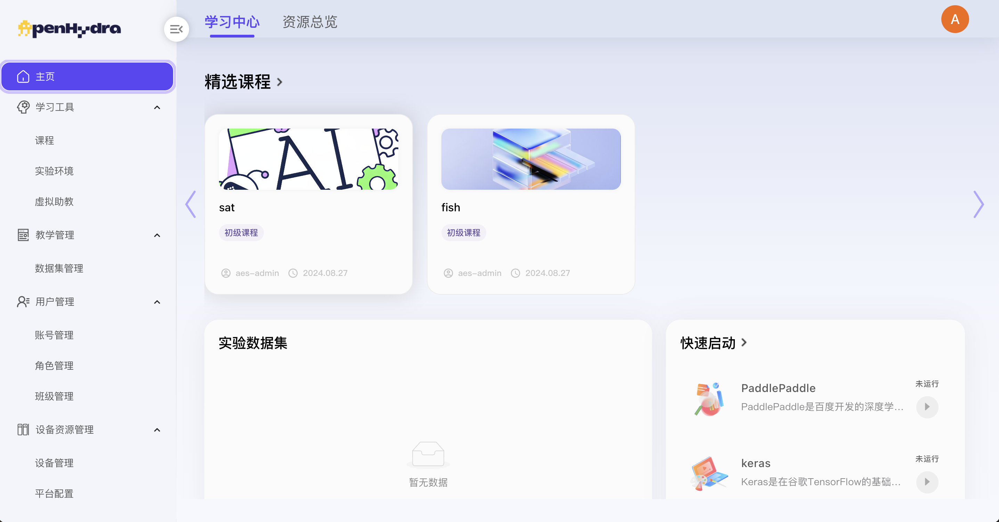
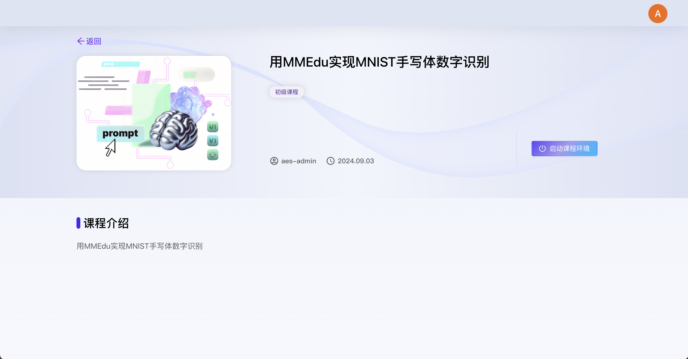
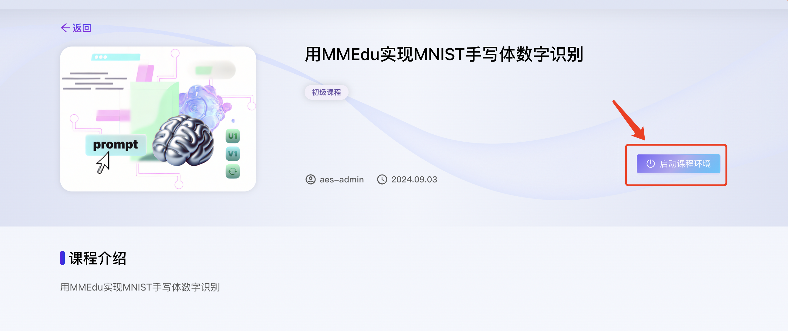
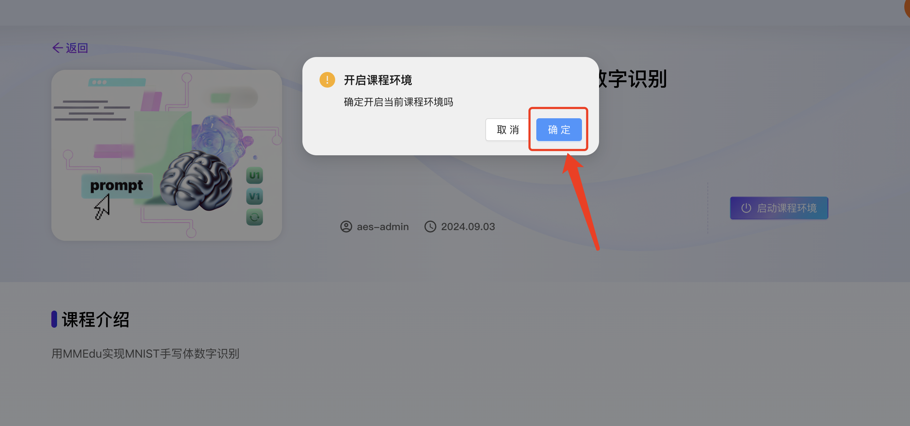
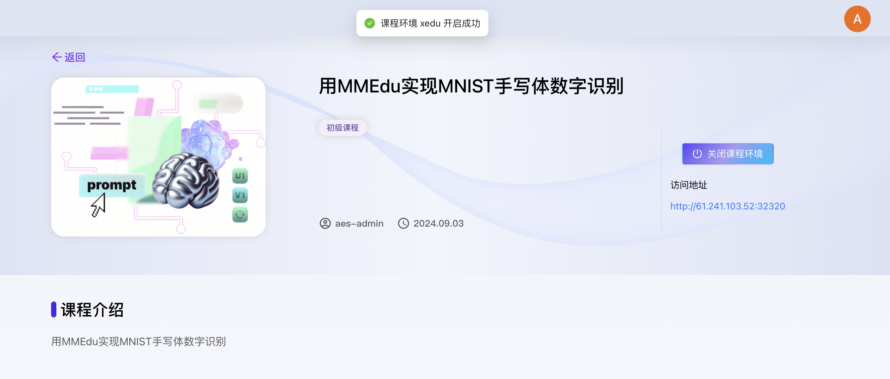
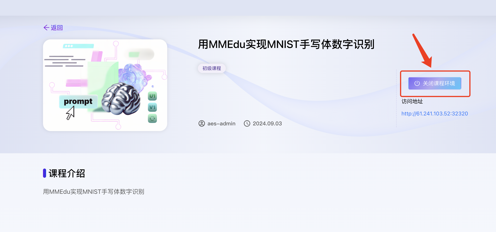
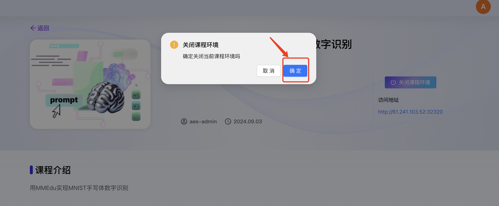

# AI教育平台
## 目录
[TOC]
## 一.主页
### 1.1 学习中心
#### 1.1.1 登录
1. 用户访问AI教育平台地址 **【此处环境地址待补充】**
2. 输入初始账号名称 ‘ase-admin’；
3. 输入初始登录密码 ‘YXNlLXBhc3N3b3Jk’；
4. 点击登录进入AI教育平台首页；

#### 1.1.2 查看学习中心
1. 登录AI教育平台进入主页-学习中心；
2. 查看学习中心页面内容包括：
   - **精选课程**：课程名称、课程难度、课程介绍；
   - **实验数据集**：数据集名称、上传时间；
   - **快速启动**：实验环境名称、启动/关闭设备按钮；

#### 1.1.3 查看课程详情
1. 登录AI教育平台进入主页-学习中心；
2. 选择某个课程点击进入课程详情页面；
3. 查看课程详情页面内容包括：课程名称、课程难度、课程介绍及启动实验环境按钮；

#### 1.1.4 启动实验环境学习
1. 登录AI教育平台进入主页-学习中心；
2. 选择某个课程点击进入课程详情页面；
3. 点击“启动实验环境”按钮启动容器设备；

4. 在弹出的提示确认框中点击‘确定’按钮；

5. 成功启动实验环境，环境状态由“未启动”变为“运行中”，“开启实验环境”按钮变为“关闭实验环境”按钮，显示实验环境port，用户点击可进入实验环境；
   

#### 1.1.5 关闭实验环境学习
前提：课程中存在正在运行中的实验环境；
1. 登录AI教育平台进入主页-学习中心；
2. 选择某个课程点击进入课程详情页面；
3. 点击“关闭实验环境”按钮启动容器设备；

4. 在弹出的提示确认框中点击‘确定’按钮；
   

5. 成功关闭实验环境，环境状态由“运行中”变为“未启动”；“关闭实验环境”按钮变为“开启实验环境”按钮；实验环境port隐藏；
   
