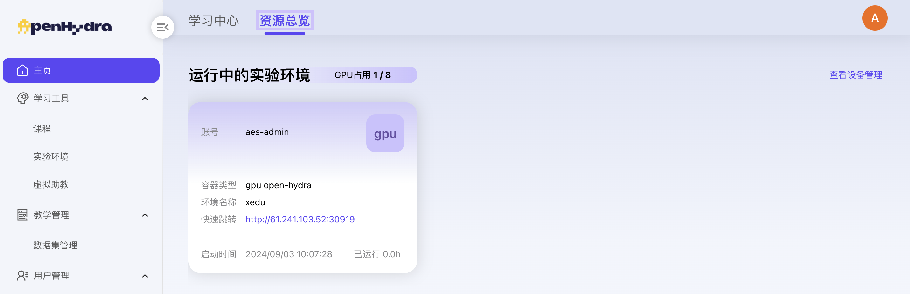
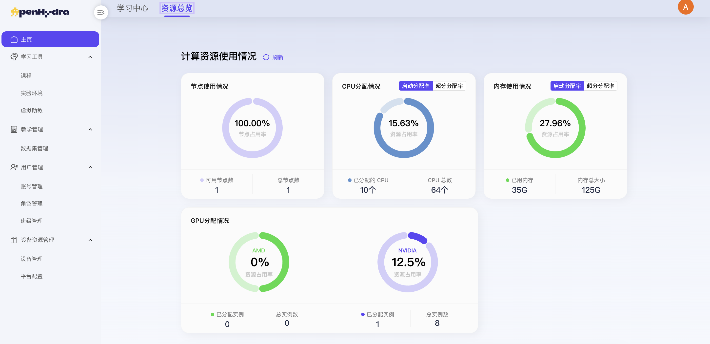

# AI教育平台
## 一. 主页
### 1.2 资源总览
#### 1.2.1 查看资源总览
1. 登录AI教育平台进入主页-资源总览；
2. 查看资源总览页面内容包括：
   - **运行中的实验环境**：CPU占用数、GPU占用数、账号名称、容器类型、环境名称、快速跳转链接及“查看设备管理”按钮；
   - **计算资源使用情况**：
     - 节点使用情况：节点可用率、可用节点数、总节点数
     - CPU分配情况：资源占用率、已分配的CPU、CPU总数
     - 内存使用情况：资源占占用率、已用内存、内存总大小
   - **GPU分配情况**：不同品牌CPU的资源占用率、已分配实例、总实例数以及配置信息；

  

  