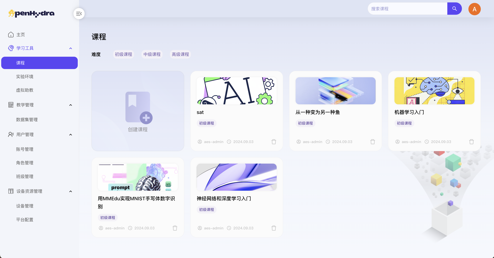
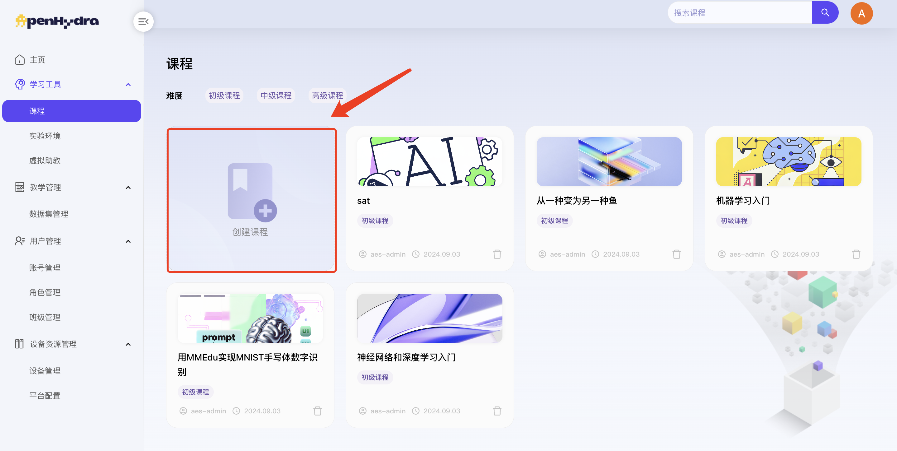
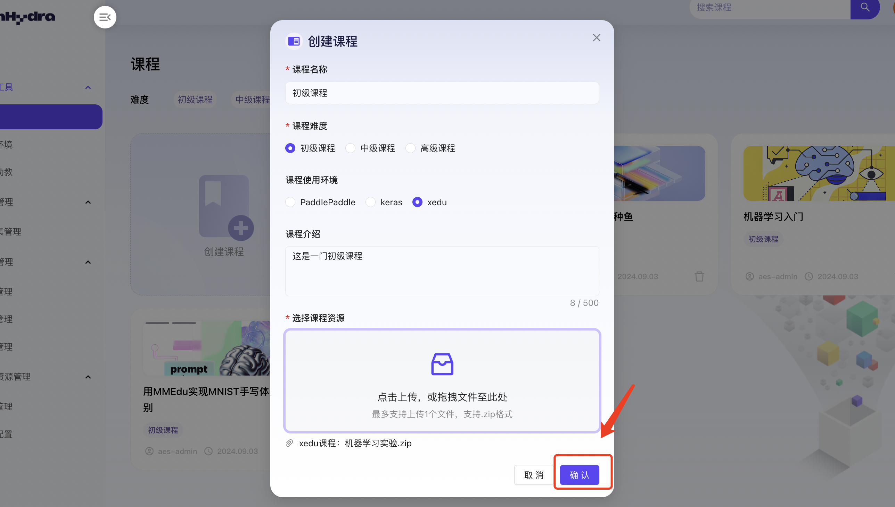
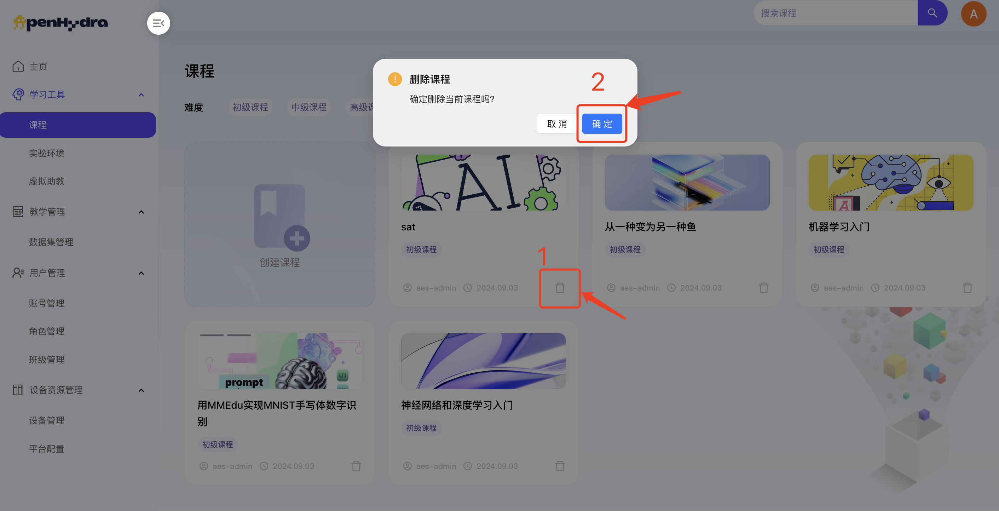

# 开源AI教育平台
## 二、学习工具
### 2.1 课程
功能概述：课程模块是开源AI教育平台的核心组成部分，旨在为用户提供一个全面、便捷的在线课程管理环境。该模块不仅支持用户浏览和筛选各类课程，还允许用户自主创建、编辑和删除课程，以满足不同学习需求和教学目标。通过课程模块，用户可以轻松管理自己的学习资源，促进知识的传播与分享。

#### 2.1.1 查看课程页面
1. 登录开源AI教育平台进入学习工具-课程；
2. 查看课程页面内容包括：课程卡片列表及上传课程按钮，课程资源卡片包括课程名称、课程描述、上传用户、上传时间及操作按钮编辑和删除，具体见下图。

#### 2.1.2 创建课程
1. 登录开源AI教育平台进入学习工具-课程；
2. 点击“创建课程”按钮打开创建课程弹窗；

3. 在课程名称输入框中输入“初级课程”；
   1. 注：课程名称全局唯一，且不超过50字；
4. 在课程难度单选框中选择“初级难度”；
5. 在课程使用环境单选框中选择“xedu”；
6. . 在课程介绍中输入“课程介绍”；
   1. 注：添加详细的课程介绍，如简介、面向对象、教学目标等，课程介绍不超过500字；
7. 在选择文件中上传课程文件；
   1. 注：每次最多支持上传1个文件，仅支持.zip格式文件上传；
   

8. 点击“确认”按钮，成功创建课程，在课程页面中可查看；

#### 2.1.3 删除课程
1. 登录开源AI教育平台进入学习工具-课程；
2. 选择某个课程名片点击其右上角的“删除”按钮
3. 在弹出的确认框中点击“确定”按钮；

4. 成功删除课程并自动返回到课程页面，不显示已删除的课程名片；

#### 2.1.4 查看课程详情
1. 登录开源AI教育平台进入学习工具-课程；
2. 选择某个课程点击进入课程详情页面；
3. 查看课程详情页面内容包括：课程名称、课程难度、课程介绍及启动实验环境按钮；

