# AI教育平台
## 二. 学习工具
### 2.2 实验环境
功能概述：实验环境模块是AI教育平台中的一部分，它为用户提供了一个安全、高效、便捷的在线实验环境，支持多种主流AI开发框架（如PaddlePaddle、Keras）和定制化的Xedu环境。用户可以在此模块中快速开启或关闭所需的实验环境，无需在本地配置复杂的开发环境，即可开始AI项目的学习与实践。通过集成JupyterLab，用户能够方便地编写、运行和分享代码，促进知识的获取与技能的提升。

#### 2.2.1 查看实验环境
1. 登录AI教育平台进入学习工具-实验环境；
2. 查看实验环境页面内容包括：实验环境卡片列表，包括Paddle Paddle、keras、Xedu，环境简介和组建信息及开启/关闭设备按钮，具体见下图。

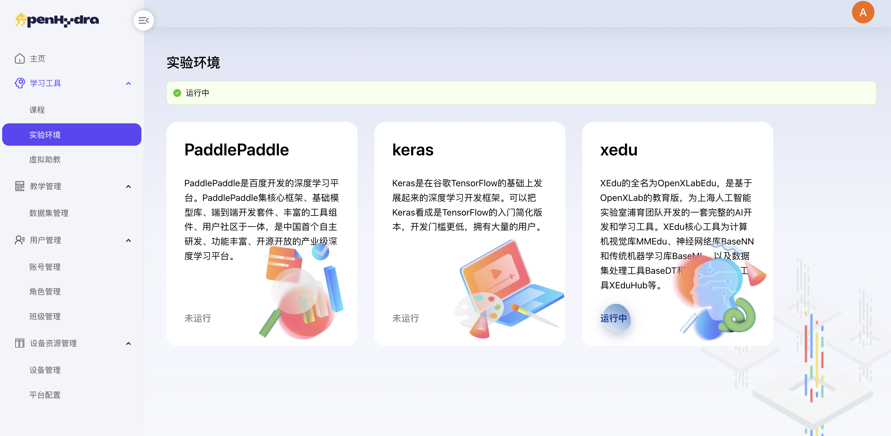

#### 2.2.2 开启实验环境
1. 登录AI教育平台进入学习工具-实验环境；
2. 选择某个环境点击“开启实验环境”按钮；
   1. 注：无法同时启动多个实验环境，每次仅能启动一个实验环境；

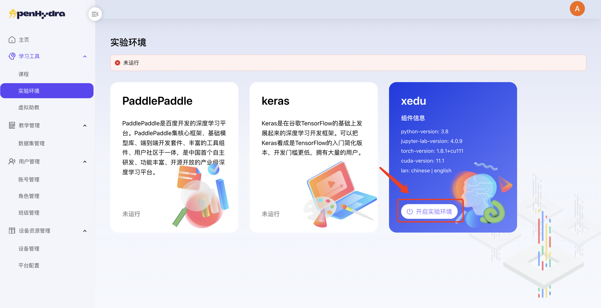

4. 点击‘确定’按钮；

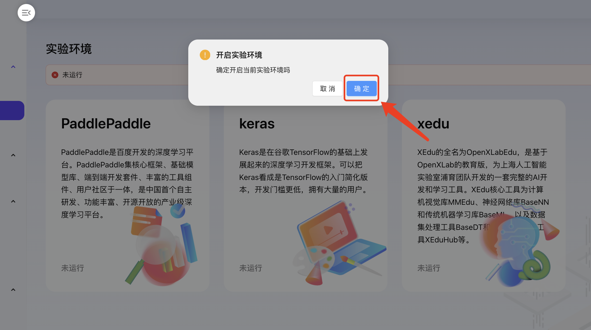

5. 成功开启实验环境，环境状态由“未启动”变为“运行中”，“开启环境”按钮变为“关闭环境”按钮，显示实验环境port，用户点击可进入实验环境；

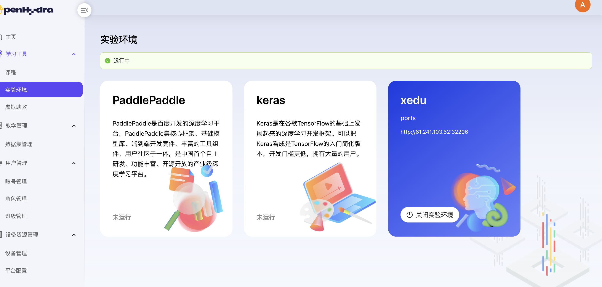

#### 2.2.3 Jupyterlab操作说明
1. 用户通过实验环境port启动容器进入Jupyterlab环境；

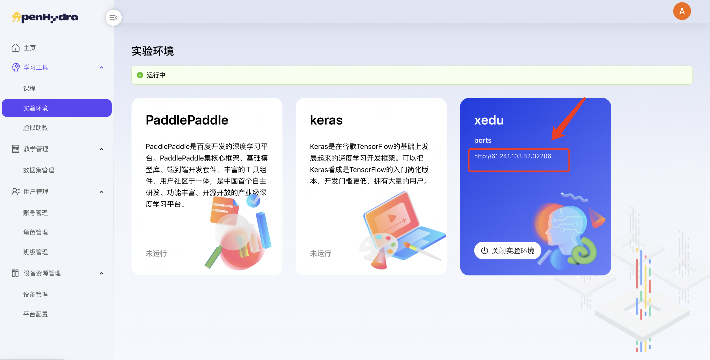

2. 将课程/数据集下的文件复制到根目录下：
   1. 方式一：新建终端，在终端中输入以下命令并执行：
   
   ```
   cp -r /root/notebook/课程名称 /root/notebook/course-public/课程名称 
   ```

   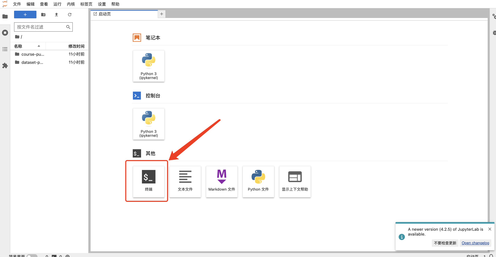

   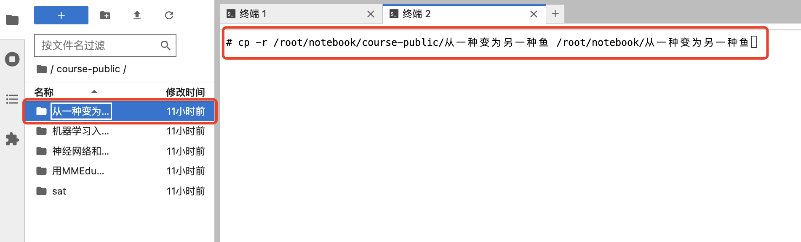

   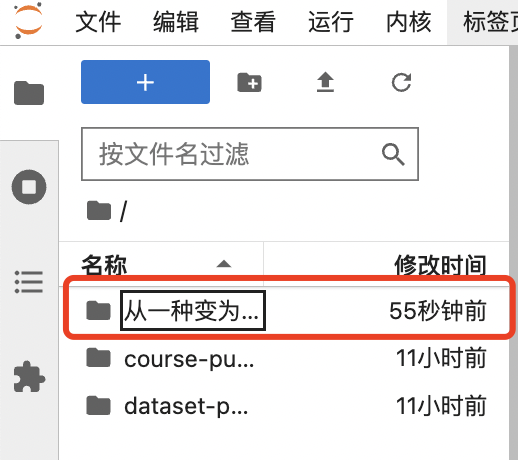

   2. 方式二：右键复制粘贴；

   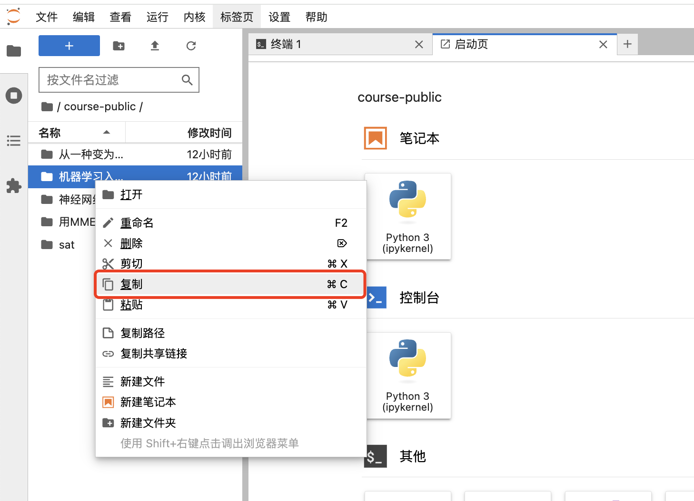

   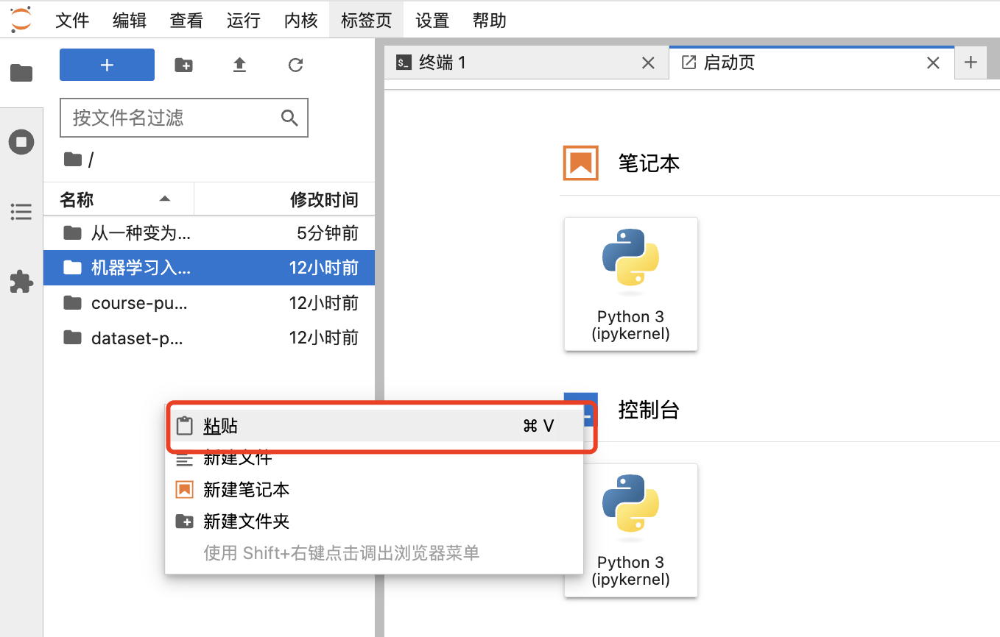
      
      1. 注：为保护course-public 和 dataset-public 文件安全，此文件无法读写，需将相关的文件复制至根目录下，用户方可执行读写操作。
3. 用户在左侧的目录中选择要执行的脚本进行运行；

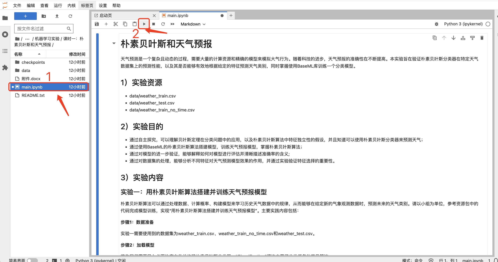

4. 用户可新建ipynd脚本，见下图；

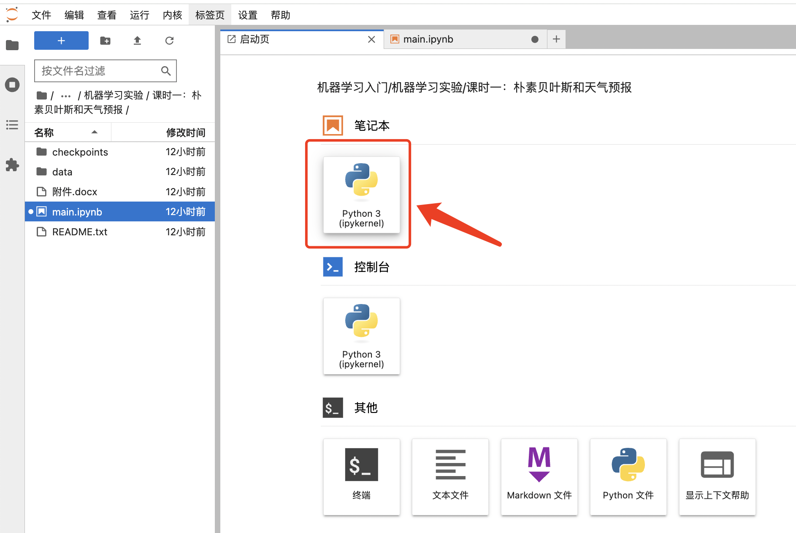

#### 2.2.4 关闭实验环境
1. 登录AI教育平台进入学习工具-实验环境；
2. 选择某个运行中的环境点击“关闭实验环境”按钮；


3. 点击‘确定’按钮；

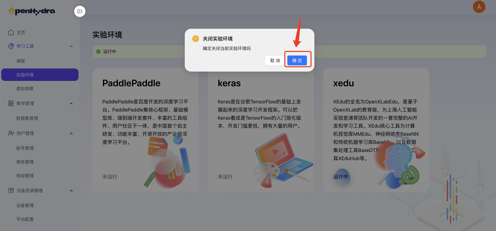

4. 成功关闭实验环境，环境状态由“运行中”变为“未启动”；“关闭环境”按钮变为“开启环境”按钮；实验环境port隐藏；