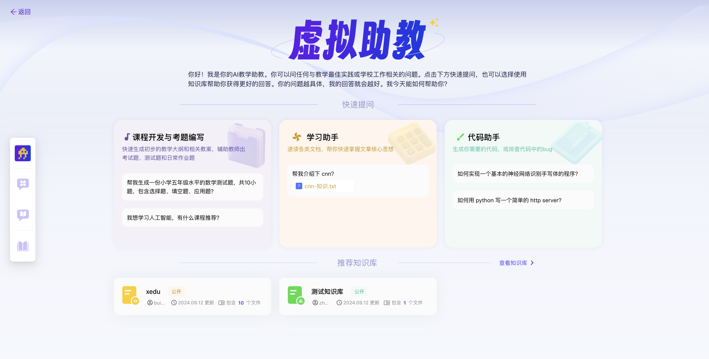
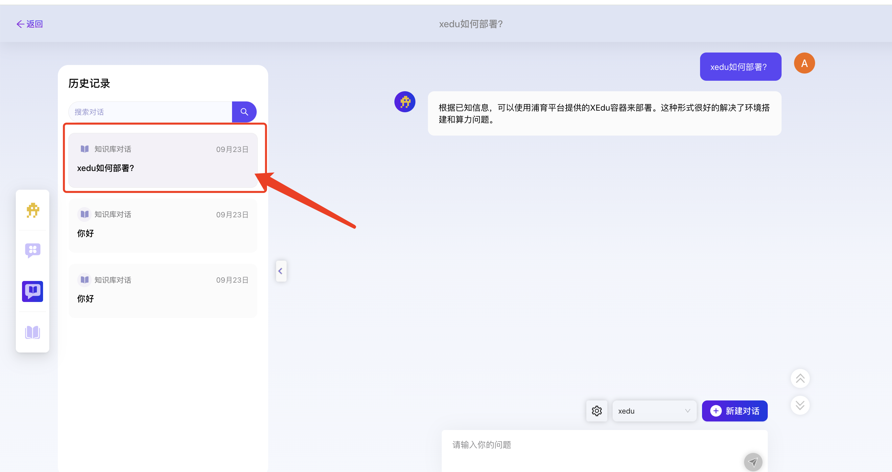
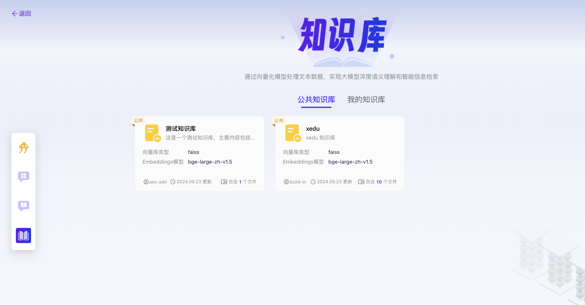

# 开源AI教育平台
## 二. 学习工具
### 2.3 虚拟助教
功能概述：虚拟助教是开源AI教育平台中的学习工具，旨在通过先进的AI技术为学生提供个性化、智能化的学习辅助服务。该模块集成了自然语言处理、机器学习及知识图谱等先进技术，能够模拟人类助教的角色，与学生进行实时互动，解答疑问，提供学习建议和知识拓展，从而极大地提升学习效率和体验。

#### 2.3.1 查看虚拟助教页面
1. 登录开源AI教育平台进入学习工具-虚拟助教；
2. 点击默认跳转首页，查看虚拟助教首页内容，显示内容包括快速提问及推荐知识库；

#### 2.3.2 查看多功能对话页面
1. 登录开源AI教育平台进入学习工具-虚拟助教；
2. 点击左侧第二个图标进入多功能对话页面，查看多功能对话页面内容，显示内容提问输入框及操作按钮“设置”“上传附件”“新建对话”；

   
#### 2.3.3 查看知识库对话页面
1. 登录开源AI教育平台进入学习工具-虚拟助教；
2. 点击左侧第三个图标进入知识库对话页面，查看知识库对话页面内容，显示内容提问输入框及操作按钮“设置”“引用知识库”；

   
#### 2.3.4 新建多功能对话
1. 登录开源AI教育平台进入学习工具-虚拟助教；
2. 点击左侧第二个图标进入多功能对话页面；
3. 在下方输入框中输入问题A，点击“发送”图标，成功获得回答A；
   1. 注：
      1. 首次进入多功能对话页面，发送问题后则默认新建一个新的多功能对话，并在左侧历史记录中保存该对话；
      2. 用户可点击“新建对话”按钮创建一个新的对话；
4. 点击“设置”图标，打开多功能对话设置弹窗，可修改设置内容如下：
   1. **基础设置：**
      1. 在基础LLM模型下拉框中选择模型；
      2. 在温度数值栏中调节温度；
         1. 注：温度默认设置值；
      3. 在历史对话轮数数值栏中调节历史对话轮数；
         1. 注：历史对话轮数默认设置值；

5. 点击“确认”按钮保存多功能对话设置，返回至多功能对话页面；
6. 在下方输入框中输入问题A，点击“发送”图标，成功获得回答B；

#### 2.3.5 多功能对话上传附件
1. 登录开源AI教育平台进入学习工具-虚拟助教；
2. 点击左侧第二个图标进入多功能对话页面；
3. 点击“上传附件”图标，选择本地文件上传；
   1. 注：
      1. 单次允许上传一个文件，每轮对话最多允许上传一个文件；
      2. 文件最大不超过50MB，支持.txt .docx .jpg .md .pptx .pdf .csv格式；
      3. 若正在进行多功能对话，上传附件自动新建一个新对话；

4. 在下方输入框中输入问题A，点击“发送”图标，成功获得回答A；

#### 2.3.5 查看多功能对话历史记录
1. 登录开源AI教育平台进入学习工具-虚拟助教；
2. 点击左侧第二个图标进入多功能对话页面；
3. 点击左侧的历史记录；
4. 成功展开历史记录列表，显示内容包括搜索框、历史记录名称、历史记录对话创建时间；

#### 2.3.6 多功能对话历史记录名称模糊搜索
1. 登录开源AI教育平台进入学习工具-虚拟助教；
2. 点击左侧第二个图标进入多功能对话页面；
3. 点击左侧的历史记录，展开历史记录；
4. 在“搜索历史记录名称”搜索框中输入历史记录名称；
5. 模糊搜索成功；

#### 2.3.7 多功能对话历史记录恢复对话
1. 登录开源AI教育平台进入学习工具-虚拟助教；
2. 点击左侧第二个图标进入多功能对话；
3. 点击左侧的历史记录，展开历史记录；
4. 选择某个历史记录对话点击恢复对话至多功能对话页面；
   1. 注：
      1. 历史记录恢复后可查看历史对话内容；
      2. 若原历史记录对话中存在附件，恢复对话后附件仍保留；

#### 2.3.6 新建知识库对话
1. 登录开源AI教育平台进入学习工具-虚拟助教；
2. 点击左侧第三个图标进入知识库对话页面；
3. 点击“引用知识库”按钮选择一个知识库；
   1. 注：
      1. 知识库对话必须引用知识库方可发送对话；
      2. 当切换引用知识库时，则自动保存当前对话至历史记录并开启新的对话，新的对话内容将保存为新的历史记录；
4. 在下方输入框中输入问题A，点击“发送”图标，成功获得回答A；
5. 点击“设置”图标，打开知识库对话设置弹窗，可修改设置内容如下：
   1. **基础设置：**
      1. 在基础LLM模型下拉框中选择模型；
      2. 在温度数值栏中调节温度；
         1. 注：温度默认设置值；
      3. 在历史对话轮数数值栏中调节历史对话轮数；
         1. 注：历史对话轮数默认设置值；
   2. **知识库设置：**
      1. 在匹配知识条数数值栏中调节匹配知识条数；
         1. 注：匹配知识条数默认设置值；
      2. 在只是匹配分数阈值数值栏中调节知识匹配分数阈值；
         1. 注：知识匹配分数阈值默认设置值；
6. 点击“确认”按钮保存知识库对话设置，返回至知识库对话页面；
7. 在下方输入框中输入问题A，点击“发送”图标，成功获得回答B；

 #### 2.3.7 查看知识库对话历史记录
1. 登录开源AI教育平台进入学习工具-虚拟助教；
2. 点击左侧第三个图标进入知识库对话页面；
3. 点击左侧的历史记录；
4. 成功展开历史记录列表，显示内容包括搜索框、历史记录名称、引用知识库名称、历史记录对话创建时间；

#### 2.3.8 知识库对话历史记录名称模糊搜索
1. 登录开源AI教育平台进入学习工具-虚拟助教；
2. 点击左侧第三个图标进入知识库对话页面；
3. 点击左侧的历史记录，展开历史记录；
4. 在“搜索历史记录名称”搜索框中输入历史记录名称；
5. 模糊搜索成功；

#### 2.3.9 知识库对话历史记录恢复对话
1. 登录开源AI教育平台进入学习工具-虚拟助教；
2. 点击左侧第三个图标进入知识库对话；
3. 点击左侧的历史记录，展开历史记录；
4. 选择某个历史记录对话点击恢复对话至知识库对话页面；
   1. 注：
      1. 历史记录恢复后可查看历史对话内容；
      2. 引用知识库默认选中历史记录中的引用知识库；

#### 2.3.10 查看知识库页面
1. 登录开源AI教育平台进入学习工具-虚拟助教；
2. 点击左侧第四个图标进入知识库页面；
3. 成功进入知识库页面，显示内容包括两个tab“公共知识库”和“我的知识库”，知识库卡片包括知识库名称、知识库描述、向量库类型、Embeddings模型、上传用户、更新时间、文件数及操作按钮编辑和删除。
   1. 注：公共知识库无法编辑和删除，用户需在我的知识库中编辑和删除；

#### 2.3.11 创建知识库
1. 登录开源AI教育平台进入学习工具-虚拟助教；
2. 点击左侧第四个图标进入知识库页面，点击‘我的知识库’进入我的知识库tab；
3. 点击“新建知识库”按钮打开新建知识库弹窗；
4. 在知识库名称输入框中输入“用户手册”；
   1. 注：知识库名称输入仅限英文与数字；
5. 在描述中输入“描述”；
   1. 注：描述输入内容不超过100字；
6. 在向量库类型下拉框中选择向量库类型；
7. 在Embeddings模型下拉框中选择Embeddings模型；
8. 在知识库可见范围单选框中选择权限；
   1. 注：
      1. 公开知识库会显示在公共知识库和我的知识库中；
      2. 班级知识库和私有知识库仅显示在我的知识库中；
      3. 若需修改知识库可见范围，可参考  操作；
9.  点击“创建”按钮，成功创建知识库，并自动跳转至上传知识库文件页面；

#### 2.3.12 知识库上传文件
1. 登录开源AI教育平台进入学习工具-虚拟助教；
2. 点击左侧第四个图标进入知识库页面，点击‘我的知识库’进入我的知识库tab；
3. 选择某个知识库点击进入知识库详情页面；
4. 点击“上传文件”按钮选择本地文件上传；
   1. 注：每次上传几个文件；文件上传限制；
   2. 知识库上传数量不限制，单个文件大小不超过10MB；
   3. 支持文件上传类型.txt.docx.md.pdf.csv格式；

#### 2.3.13 编辑知识库
前提：存在已创建的知识库；
1. 登录开源AI教育平台进入学习工具-虚拟助教；
2. 点击左侧第四个图标进入知识库页面，点击‘我的知识库’进入我的知识库tab；
3. 选择某个知识库点击其右上角的‘编辑’按钮打开编辑知识库弹窗；
4. 在知识库名称输入框中编辑“用户手册”；
   1. 注：知识库名称输入仅限英文与数字；
5. 在描述中编辑“描述”；
   1. 注：描述输入内容不超过100字；
6. 在向量库类型下拉框中编辑向量库类型；
7. 在Embeddings模型下拉框中编辑Embeddings模型；
8. 在知识库可见范围单选框中编辑权限；
   1. 注：
      1. 公开知识库会显示在公共知识库和我的知识库中；
      2. 班级知识库和私有知识库仅显示在我的知识库中；
      3. 若需修改知识库可见范围，可参考  操作；
9. 点击“确定”按钮，成功编辑知识库，并自动跳转至上传知识库文件页面；

#### 2.3.14 删除知识库
1. 登录开源AI教育平台进入学习工具-虚拟助教；
2. 点击左侧第四个图标进入知识库页面，点击‘我的知识库’进入我的知识库tab；
3. 选择某个知识库点击其右上角的“删除”按钮
4. 在弹出的确认框中点击“确定”按钮；
5. 成功删除知识库并自动返回到知识库页面，不显示已删除的知识库；

