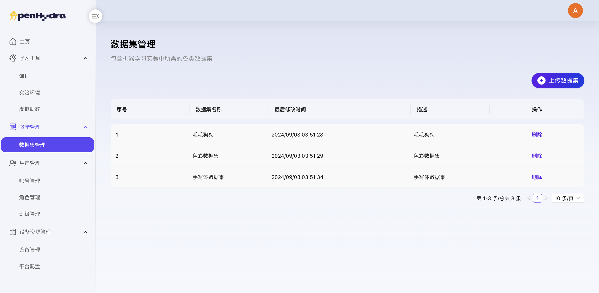
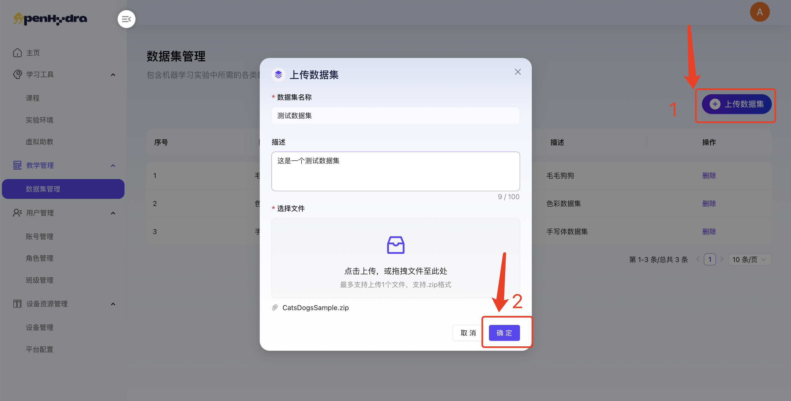
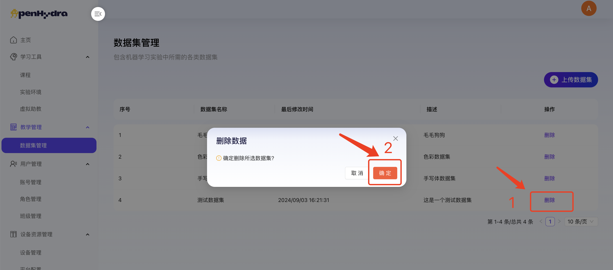

# OpenHydra用户使用手册
## 三、 教学管理
### 3.1 数据集
功能概述：
数据集模块是OpenHydra中教学管理功能的组成部分，旨在为教育者和学习者提供便捷的数据集管理服务。通过该模块，用户可以轻松上传、查看、编辑及删除各类数据集，为机器学习、深度学习等AI相关课程提供丰富的数据资源支持。

#### 3.1.1 查看数据集页面
1. 登录OpenHydra进入教学管理-数据集；
2. 查看数据集页面内容包括：数据集卡片列表及上传数据集按钮，数据集卡片包括数据集名称、数据集描述、上传用户、上传时间及操作按钮编辑和删除，具体见下图。

#### 3.1.2 上传数据集
1. 登录OpenHydra进入教学管理-数据集；
2. 点击“上传数据集”按钮打开上传数据集弹窗；
3. 在数据集名称输入框中输入“数据集名称”；
4. 在描述输入框中输入“描述”；
   1. 注：数据集描述内容不超过100字；
5. 在选择文件中上传数据集文件；
   1. 注：每次最多支持上传1个文件，仅支持.zip格式文件上传；

6. 点击“确认”按钮，成功上传数据集，在数据集页面中可查看；

#### 3.1.3 删除数据集
1. 登录OpenHydra进入教学管理-数据集；
2. 选择某个数据集名片点击其右上角的“删除”按钮
3. 在弹出的确认框中点击“确定”按钮；

4. 成功删除数据集并自动返回到数据集页面，不显示已删除的数据集名片；