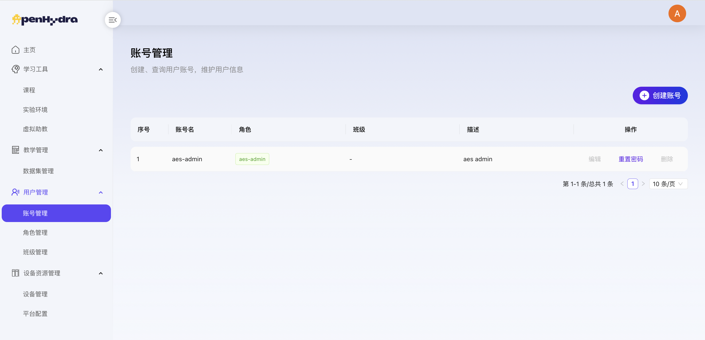
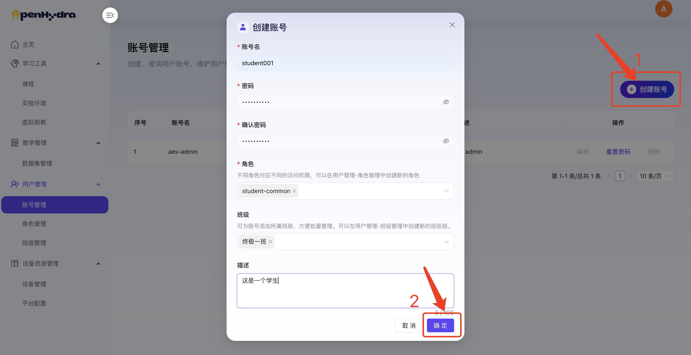
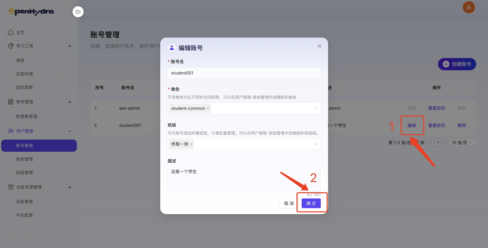
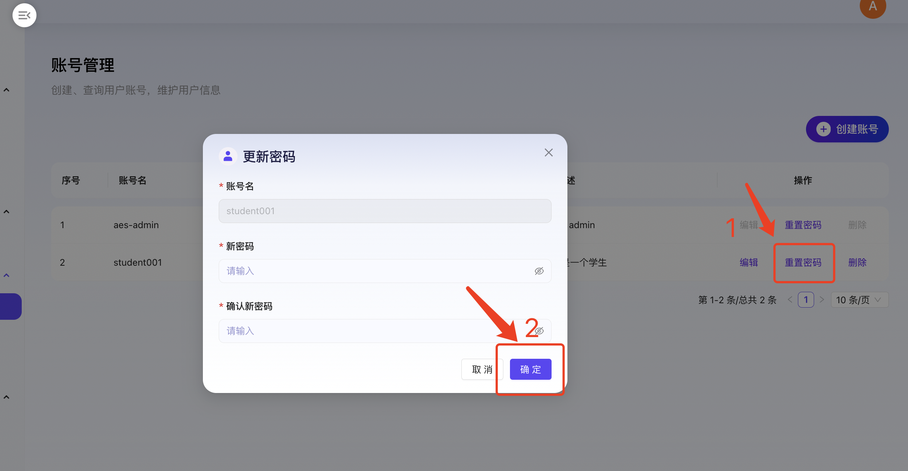
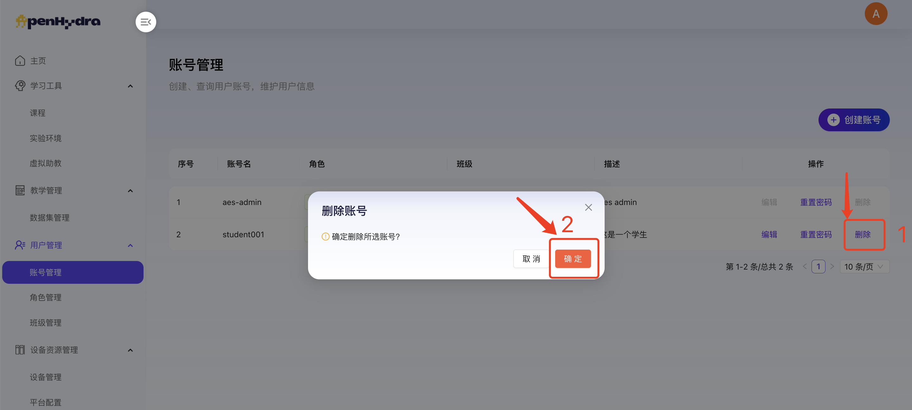

# AI教培平台
## 四. 用户管理
### 4.1 账号管理
功能概述：
账号管理模块是AI教培平台的组成部分之一，旨在提供全面、便捷的用户账号管理服务。该模块通过精细化的功能设计，实现了用户账号的创建、编辑、查看及删除等操作，确保了平台用户信息的安全性与可维护性。

#### 4.1.1 查看账号管理页面
1. 登录AI教培平台进入用户管理-账号管理；
2. 查看账号管理页面内容包括账号列表及创建账号按钮，账号列表包括序号、账号名、角色、班级、描述及操作按钮编辑、重置密码和删除。

#### 4.1.2 创建账号
1. 登录AI教培平台进入用户管理-账号管理；
2. 点击“创建账号”按钮打开创建账号弹窗；
3. 在账号名输入框中输入“张三”；
   1. 注：允许输入英文（大小写）和数字字符，且开头需为英文字符，输入长度为1~30个字符
4. 在密码输入框中输入“密码”；
   1. 注：
      1. 英文状态下 ‘数字’、‘字母（大小写）’ 至少各一个，长度为6-20个字符，且不能与上一次密码相同。
      2. 允许使用除 ‘空格’、‘Tab’ 以外的所有键盘允许输入的英文特殊字符；
5. 在确认密码输入框中输入“确认密码”；
   1. 注：确认密码需与密码相同；
6. 在角色下拉框中选择“学生”；
   1. 注：角色允许多选；
7. 在班级下拉框中选择“大班”；
   1. 注：班级允许多选；
8. 在描述输入框中输入“描述”；
   1. 注：描述内容不超过100字符；

1.  点击“确认”按钮，成功上传账号管理，在账号管理页面中可查看；
   
#### 4.1.3 编辑账号
1. 登录AI教培平台进入用户管理-账号管理；
2. 选择某个账号点击其后的“编辑”按钮打开编辑账号弹窗；
3. 在账号名输入框中修改输入“李四”；
4. 在角色下拉框中修改选择“老师”；
   1. 注：角色允许多选；
7. 在班级下拉框中修改选择“中班”；
   1. 注：班级允许多选；
5. 在描述输入框中输入“描述”；
   1. 注：描述内容不超过100字；

1.  点击“确认”按钮，成功编辑账号，在账号管理页面中可查看最新账号信息；

#### 4.1.4 重置密码
1. 登录AI教培平台进入用户管理-账号管理；
2. 选择某个账号点击其后的“重置密码”按钮打开重置密码弹窗；
3. 在新密码输入框中输入新密码；
4. 在确认新密码输入框中输入确认密码；
   1. 注：确认新密码需与新密码一致；
5. 点击‘确定’按钮保存新密码；

6. 用户可使用新密码登录平台；

#### 4.1.5 删除账号
1. 登录AI教培平台进入用户管理-账号管理；
2. 选择某个账号点击其后的“删除”按钮；
3. 在弹出的确认框中点击“确定”按钮；

4. 成功删除账号并自动返回到账号管理页面，不显示已删除的账号；