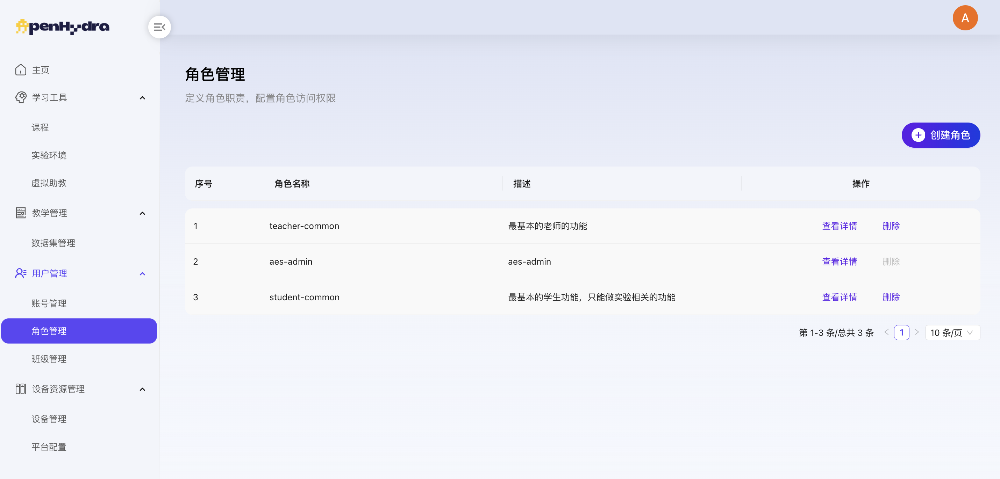
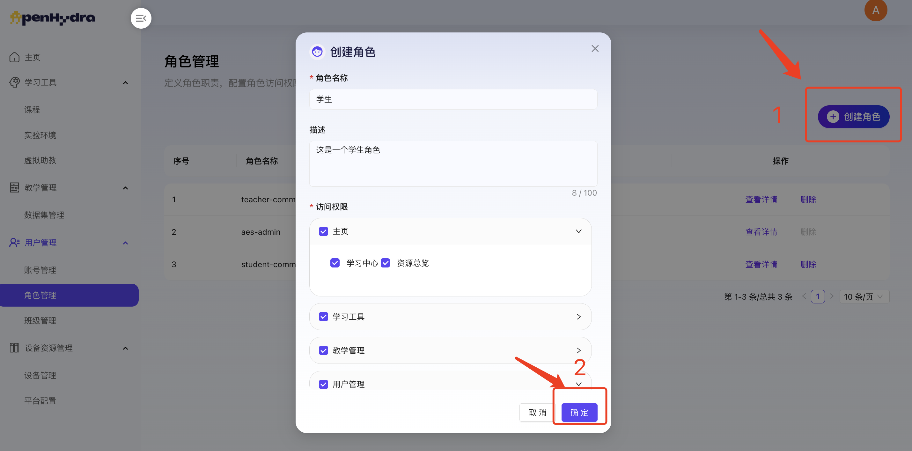
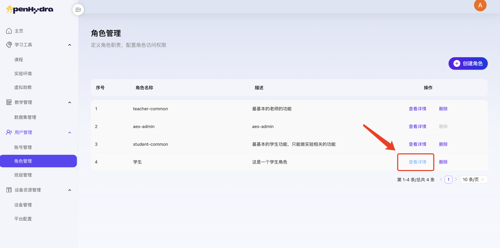
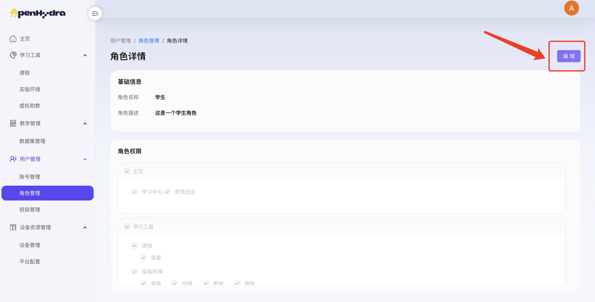
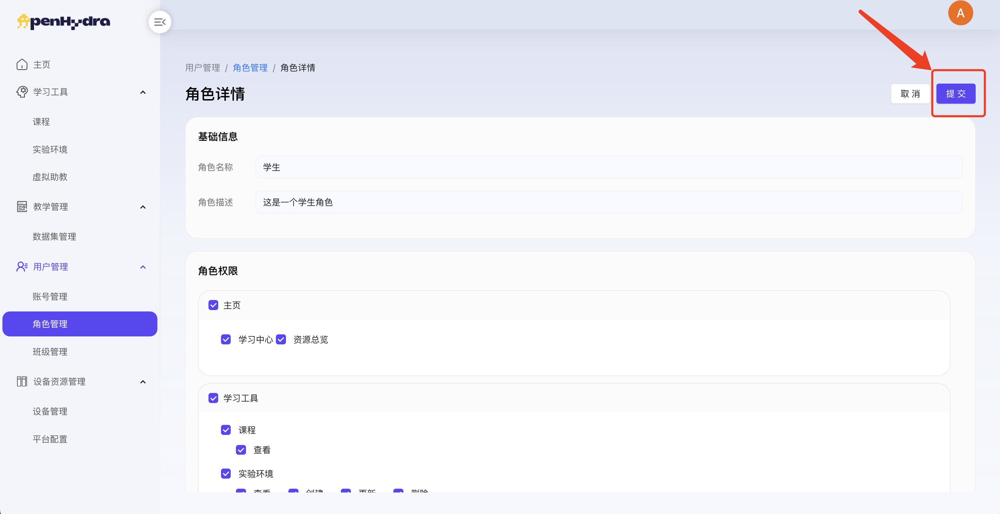
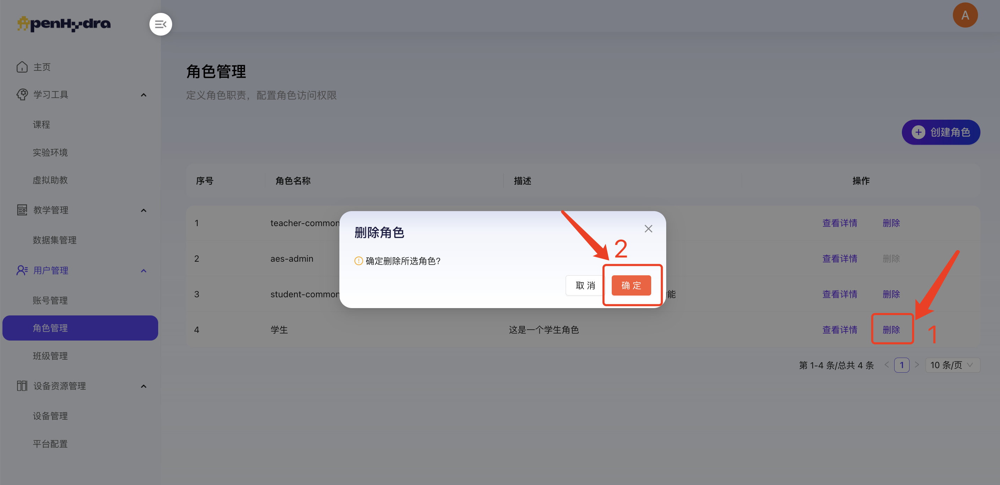

# 开源AI教育平台
## 四. 用户管理
### 4.2 角色管理
功能概述：
角色管理是开源AI教育平台中的权限控制部分，旨在高效、安全地管理平台上所有用户的身份信息、权限分配及角色定义。通过精细化的角色管理功能，平台能够确保不同用户群体拥有与其职责相匹配的访问权限和操作能力，从而提升平台整体的安全性和用户体验。

#### 4.2.1 查看角色管理页面
1. 登录开源AI教育平台进入用户管理-角色管理；
2. 查看角色管理页面内容包括角色列表及创建角色按钮，角色列表包括序号、角色、描述及操作按钮编辑和删除。

#### 4.2.2 创建角色
1. 登录开源AI教育平台进入用户管理-角色管理；
2. 点击“创建角色”按钮打开创建角色弹窗；
3. 在角色名称输入框中输入“学生”；
   1. 注：角色名称不超过50字；
4. 在描述中输入“描述”；
   1. 输入对角色的描述，如权限、职责等，不超过100字；
5. 在访问权限中选择“访问权限”
   1. 注：访问权限包括对不同模块的访问权限和功能权限；
6.  点击“确认”按钮，成功创建角色，在角色管理页面中可查看；
   

#### 4.2.3 编辑角色
1. 登录开源AI教育平台进入用户管理-角色管理；
2. 选择某个角色点击其后的“查看详情”按钮进入角色详情页面；

3. 点击“编辑”按钮可编辑角色基础信息和角色权限；

2. 在角色名输入框中修改输入“老师”；
3. 在角色描述输入框中修改输入“描述”；
   1. 注：描述内容不超过100字；
4. 在角色权限中修改角色权限；
5. 点击“提交”按钮，成功编辑角色，在角色管理页面中可查看最新角色信息；

#### 4.2.4 删除角色
1. 登录开源AI教育平台进入用户管理-角色管理；
2. 选择某个角色点击其后的“删除”按钮；
3. 在弹出的确认框中点击“确定”按钮；
   1. 注：删除需谨慎！删除角色后关联用户也会失去当前角色权限。
4. 成功删除角色并自动返回到角色管理页面，不显示已删除的角色；

