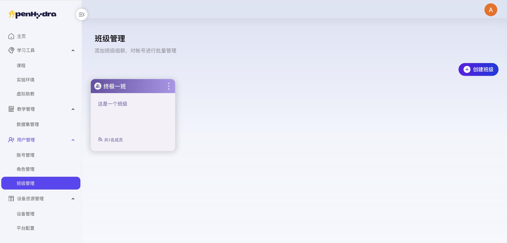
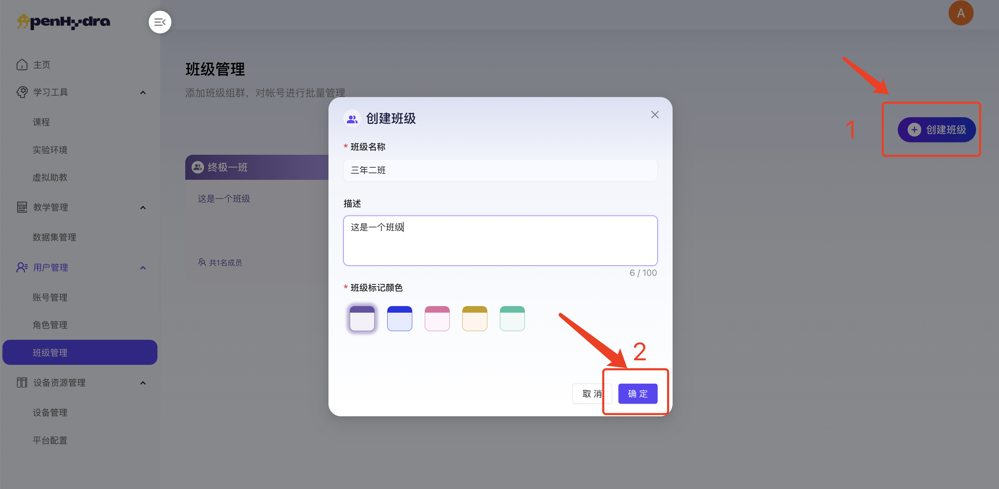
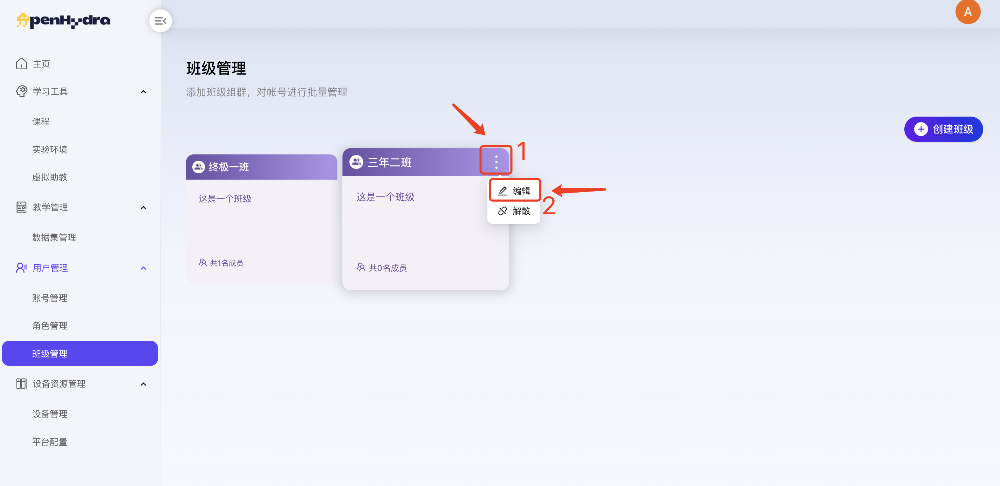
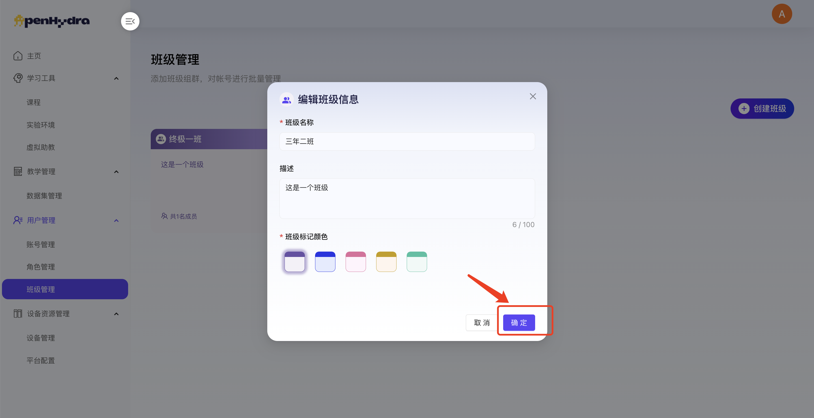
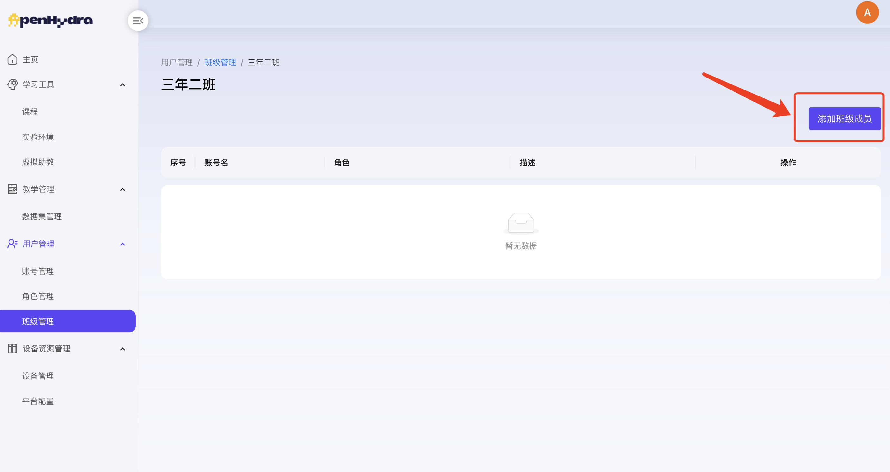
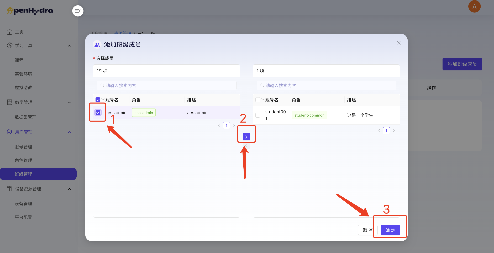
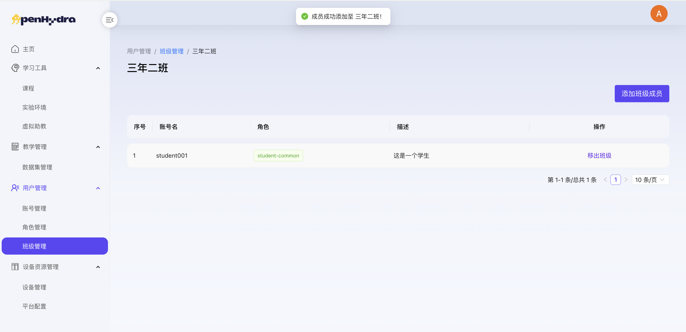
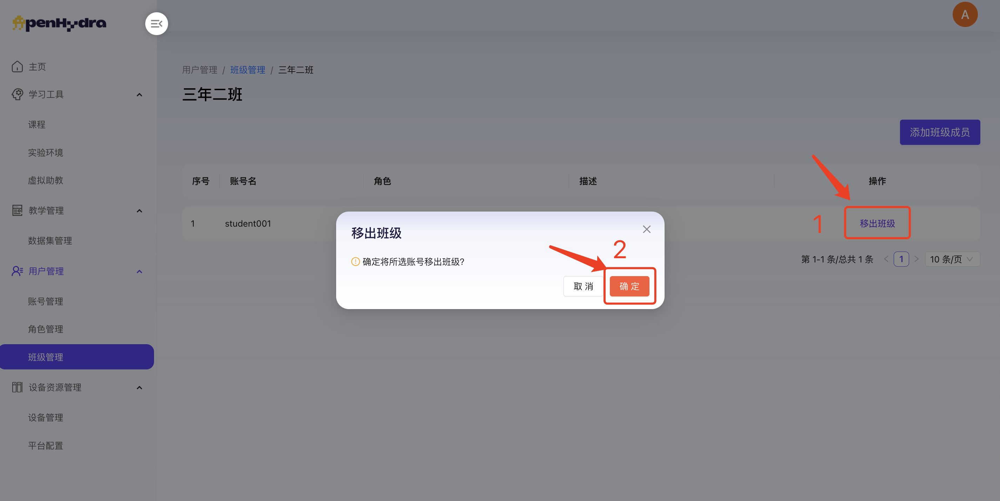
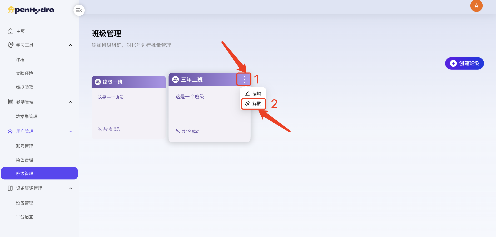
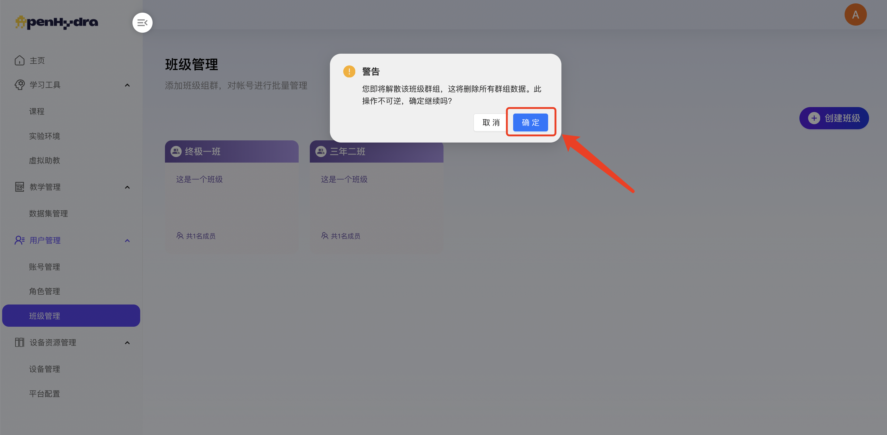

# AI教育平台
## 四. 用户管理
### 4.3 班级管理
功能概述：班级管理模块是AI教育平台中负责维护和管理班级信息的关键部分。该模块旨在通过直观易用的界面，帮助管理员或教师高效地创建、编辑、管理班级及其成员，确保教学资源的合理分配与利用。

#### 4.3.1 查看班级管理页面
1. 登录AI教育平台进入用户管理-班级管理；
2. 查看班级管理页面内容包括班级列表及创建班级按钮，班级卡片包括班级名称、成员数量及操作按钮编辑和删除。

#### 4.3.2 创建班级
1. 登录AI教育平台进入用户管理-班级管理；
2. 点击“创建班级”按钮打开创建班级弹窗；
3. 在班级名称输入框中输入“三年二班”；
   1. 注：班级名称不超过50字；
4. 在描述中输入“描述”；
   1. 班级描述不超过100字；
5. 在班级标记颜色中选择“颜色”；
6. 点击“确认”按钮，成功创建班级，在班级管理页面中可查看；

   
#### 4.3.3 编辑班级
1. 登录AI教育平台进入用户管理-班级管理；
2. 选择某个班级点击其右上角的“编辑”按钮打开编辑编辑信息弹窗；

2. 在班级名称输入框中修改输入“四年二班”；
3. 在班级描述输入框中修改输入“描述”；
   1. 注：班级描述不超过100字；
4. 在班级编辑颜色中修改班级标记颜色；
5. 点击“确定”按钮，成功编辑班级，在班级管理页面中可查看最新班级信息；

#### 4.3.4 添加班级成员
1. 登录AI教育平台进入用户管理-班级管理；
2. 选择某个班级点击进入班级详情页面；

2. 点击右上角的“添加班级成员”按钮打开添加班级成员弹窗；
3. 选中某个成员点击中间的“>”右移图标；

4. 点击“确认”按钮，成功添加班级成员，在班级详情列表中可查看；

#### 4.3.5 移出班级
1. 登录AI教育平台进入用户管理-班级管理；
2. 选择某个班级点击进入班级详情页面；
3. 选择某个成员点击其后的“移出班级”按钮；

4. 点击“确认”按钮，成功移出班级成员；
   
#### 4.3.6 解散班级
1. 登录AI教育平台进入用户管理-班级管理；
2. 选择某个班级点击其右上角的“解散”按钮；

2. 在弹出的确认框中点击“确定”按钮；
   1. 注：解散需谨慎！解散班级后关联用户也会失去当前班级权限。

3.  成功解散班级并自动返回到班级管理页面，不显示已解散的班级；