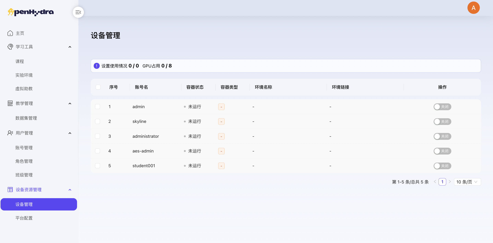
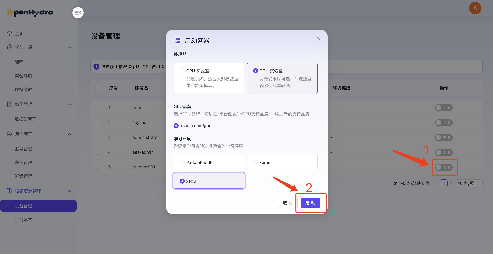
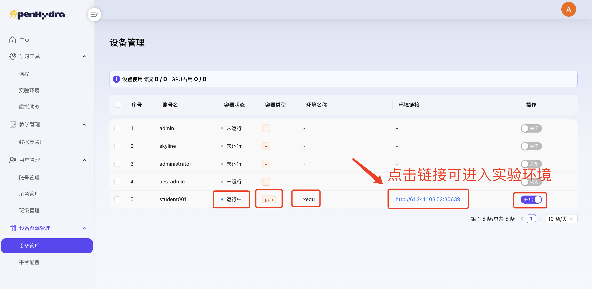
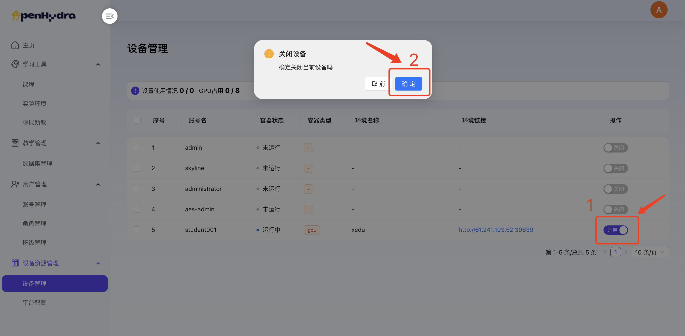

# OpenHydra用户使用手册
## 五. 设备资源管理
### 5.1 设备管理
模块描述：设备管理模块属于OpenHydra中的设备资源管理，负责集中展示、配置、启动与关闭用户所需的计算资源，确保学员和教师可以高效地访问和使用这些资源进行AI教学与实践。本模块通过直观的界面和灵活的配置选项，为用户提供了一站式的设备管理体验。

#### 5.1.1 查看设备管理
1. 登录OpenHydra进入设备资源管理-设备管理；
2. 查看设备管理页面内容包括：设备管理卡片列表，包括设置使用情况及设备列表，设备列表包括序号、账号名、角色、班级、容器状态、容器类型、环境名称、环境链接及设备启动操作按钮；

#### 5.1.2 开启设备管理
1. 登录OpenHydra进入设备资源管理-设备管理；
2. 选择某个设备点击“on”按钮弹出启动容器配置弹窗；
3. 在处理器单选框中选择“CPU实验室”；
   1. 注：若选择“GPU实验室”则跳出关联GPU品牌选项，GPU品牌需在平台配置中配置，且需检索到有空闲的GPU才会显示在GPU品牌中供选择。
4. 在学习环境单选框中选择“xedu”；
   1. 注：
      1. 更多的学习环境可由专业人员在脚本中配置；
      2. PaddlePaddle和keras学习环境启动耗费时间较长，请耐心等待。

1. 点击“启动”按钮，成功开启容器设备。
   - 容器状态由“未运行”变为“运行中”；
   - “开启环境”按钮变为“关闭环境”按钮；
   - 显示实验环境跳转链接，点击可进入实验环境；
   - 显示启动的容器类型、环境名称；

   
#### 5.1.3 关闭设备管理
1. 登录OpenHydra进入设备资源管理-设备管理；
2. 选择某个运行中的环境点击其后的“off”按钮；
3. 成功关闭设备容器，环境状态由“运行中”变为“未启动”；“off”按钮变为“on”按钮；设备管理port隐藏；

   