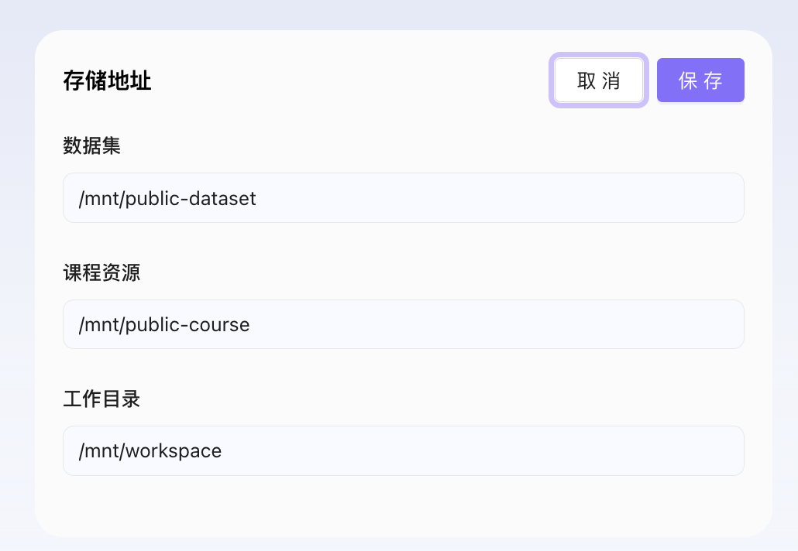
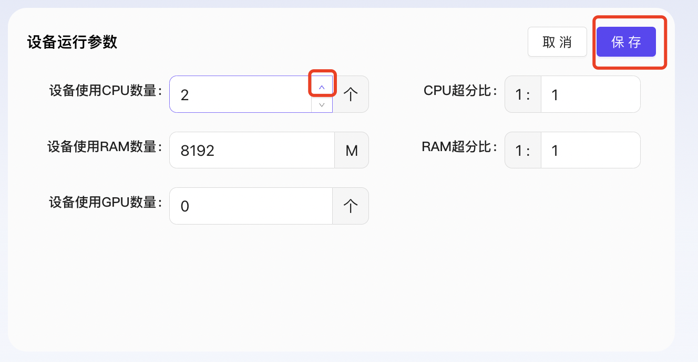
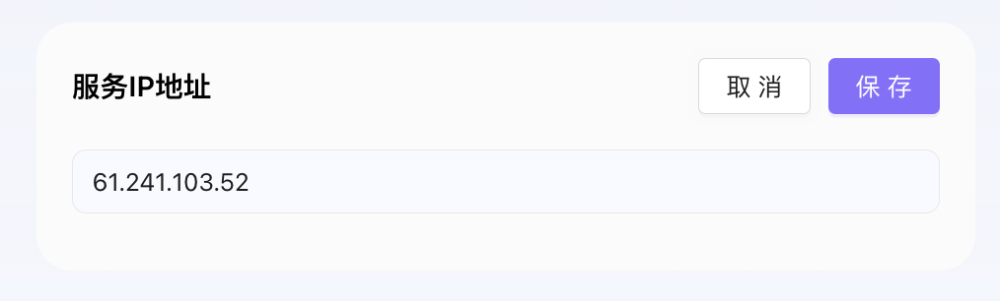
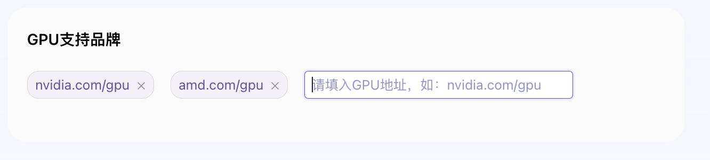

# 开源AI教育平台
## 五. 设备资源管理
### 5.2 平台配置
模块描述：
平台配置模块是开源AI教育平台的设备资源管理模块之一，它负责定义和管理平台的底层运行环境设置，确保教学资源的高效分配与系统的稳定运行。该模块提供了一系列的功能，包括但不限于查看和编辑平台的存储设置、设备运行参数、服务IP地址以及GPU支持品牌等关键信息。

#### 5.2.1 查看平台配置
1. 登录开源AI教育平台进入设备资源管理-平台配置；
2. 查看平台配置页面内容包括：
   - **存储地址：** 数据集、课程资源、工作目录
   - **设备运行参数：** 设备使用CPU数量、CPU超分比、设备使用RAM数量、RAM超分比、设备使用GPU数量
   - **服务IP地址**
   - **GPU支持品牌**
  

#### 5.2.2 编辑平台设置
1. 登录开源AI教育平台进入设备资源管理-平台配置；
2. 点击存储地址的“修改”按钮编辑存储地址，编辑内容如下：
   1. 在数据集输入框中输入“/mnt/public-dataset”；
   2. 在数据集输入框中输入“/mnt/public-course”；
   3. 在工作目录输入框中输入“/mnt/workspace”；
      1. 注：以上均只允许输入目录的绝对路径，不允许包含环境变量;
3. 点击“保存”按钮保存编辑的存储地址；

4. 点击设备运行参数的“修改”按钮编辑设备运行参数，编辑内容如下：
   1. 在设备使用CPU数量中输入数量；
   2. 在CPU超分比中输入超分比；
   3. 在设备使用RAM数量中输入数量；
   4. 在RAM超分比中输入超分比；
   5. 在设备使用GPU数量中输入数量；
      1. 注：
         1. 可通过上下箭头调节数量；
         2. 只允许填写正整数；
5. 点击“保存”按钮保存编辑的设备运行参数；

6. 点击服务IP地址的“修改”按钮编辑服务IP地址；
7. 点击“保存”按钮保存编辑的服务IP地址；

8. 在GPU支持品牌中点击“新增的GPU支持品牌”按钮；
9.  在GPU支持品牌输入框中输入“Nvidia”；
10. 回车即可保存GPU支持品牌；

